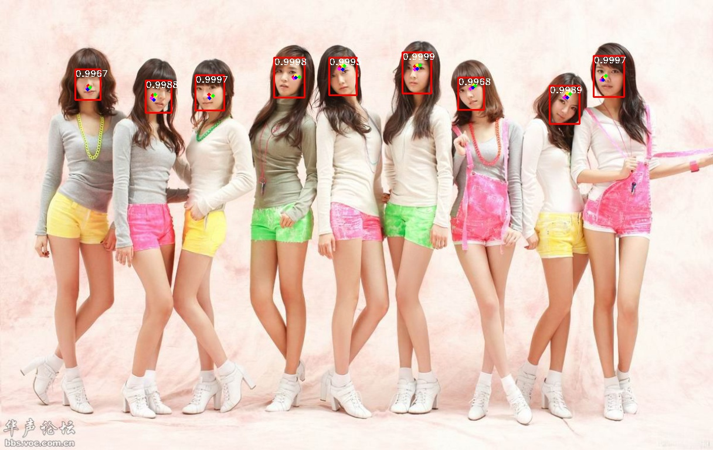

# Retinaface2Caffe

This is a project converting pytorch based retinaface to caffe model. We merged the BN layer too.

The pytorch code can be found here:https://github.com/biubug6/Pytorch_Retinaface

Note that we change the original code's **F.interpolate** to **nn.Transposed2D** witch can be found in **net.py**

## Install

Make caffe and pycaffe.

## Usage

Convert Pytorch .pth file to caffemodel: 

```cmd
python torch2caffe_dangdang.py
```

Merge BN:

```cmd
python convert_2_nonbnn.py
```

## Vis

Caffe inference:



## Contributing

PRs accepted.

## License

MIT © Richard AoruXue